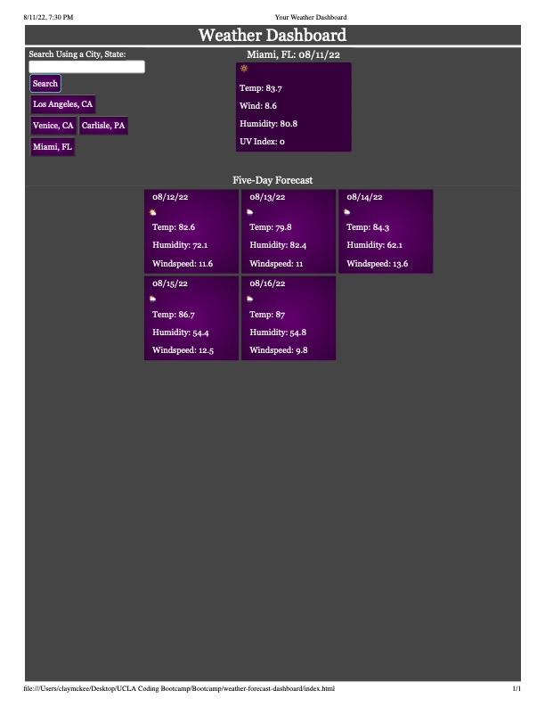

# Weather Forecast Dashboard

## Description

This app allows peopole to search a city and state  (or city and country)  to view the current weather conditions and the five-day forecast for the five days after the current day. In addition to the weather, the searches are saved and appear on the side so that the user can easily click on a saved city for that weather data to reappear. 

The HTML holds the button, user input field, and the basic headings/title. Bootstrap provided the wireframing and some styling of the search button and the jumbotron. CSS provides the rest of the styling. Javascript and Jquery interact with a weather api to fetch the data based on the user input inserted into the URL. Jquery then creates HTML elements and populates the site with the appropriate weather information as it iterates over the object array. 

## Site Screenshot

## Live Link

https://cmckee120993.github.io/weather-forecast-dashboard/

